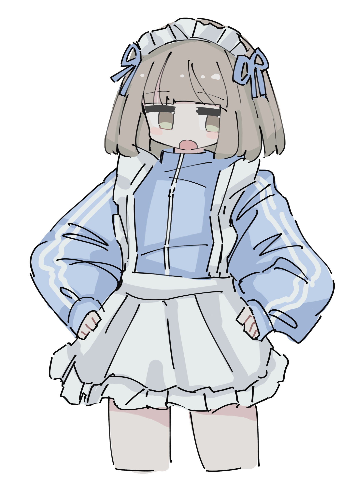

# doll

OpenClaw の感情をリアルタイムで映す、デスクトップマスコットアプリ。

<p align="center">
  
</p>

## 概要

**doll** は、ローカルで動いている [OpenClaw](https://github.com/anthropics/openclaw) AI エージェントと連動するデスクトップマスコットです。エージェントが回答するたびに、その感情（嬉しい・悲しい・怒り・驚き…）に応じてキャラクターの表情が変わります。

- 透明ウィンドウで常に最前面に表示
- ドラッグで好きな場所に配置
- OpenClaw が回答するたびに表情がリアルタイムで変化
- 10 秒間通知がなければ自動でアイドル状態に戻る

## セットアップ

### 前提

- [Node.js](https://nodejs.org/) + [pnpm](https://pnpm.io/)
- [Rust](https://www.rust-lang.org/tools/install)
- [Tauri 2 の前提環境](https://v2.tauri.app/start/prerequisites/)

### インストール & 起動

```bash
pnpm install
pnpm tauri dev
```

### OpenClaw との接続

OpenClaw の `SOUL.md` に以下を追記してください:

> After every user-visible reply, send a background doll status notification to `http://127.0.0.1:3000/status` with an emotion (`happy|sad|angry|surprised|neutral`) that matches the reply tone.

これにより、エージェントが回答するたびに `POST http://127.0.0.1:3000/status` で感情を通知し、doll の表情が連動します。

### 動作テスト

OpenClaw なしでもテストできます:

```bash
curl -X POST http://127.0.0.1:3000/status \
  -H "Content-Type: application/json" \
  -d '{"status":"responding","emotion":"happy"}'
```

またはウィンドウ右上の **⚙** メニューから Mock Status を送れます。

## 技術スタック

| レイヤー | 技術 |
|---------|------|
| デスクトップ | Tauri 2 |
| フロントエンド | React 19 + TypeScript (Vite 7) |
| バックエンド | Rust (axum HTTP サーバー) |
| リンター | Biome (TS) / clippy + rustfmt (Rust) |

## ライセンス

MIT
